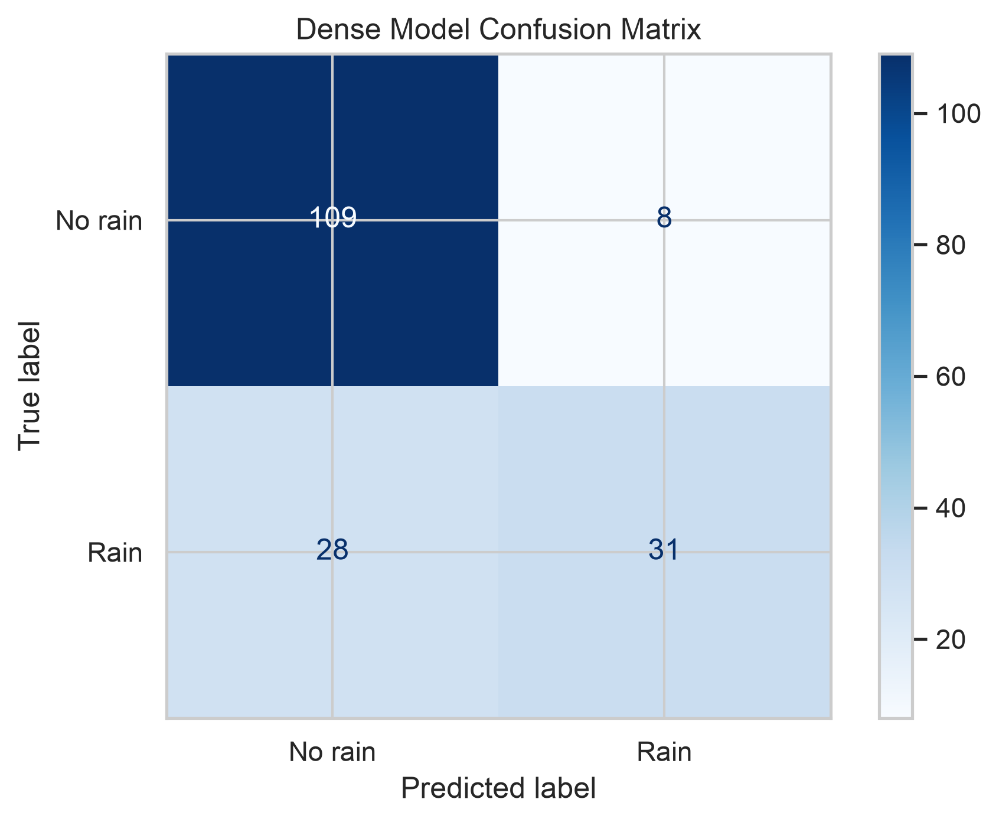
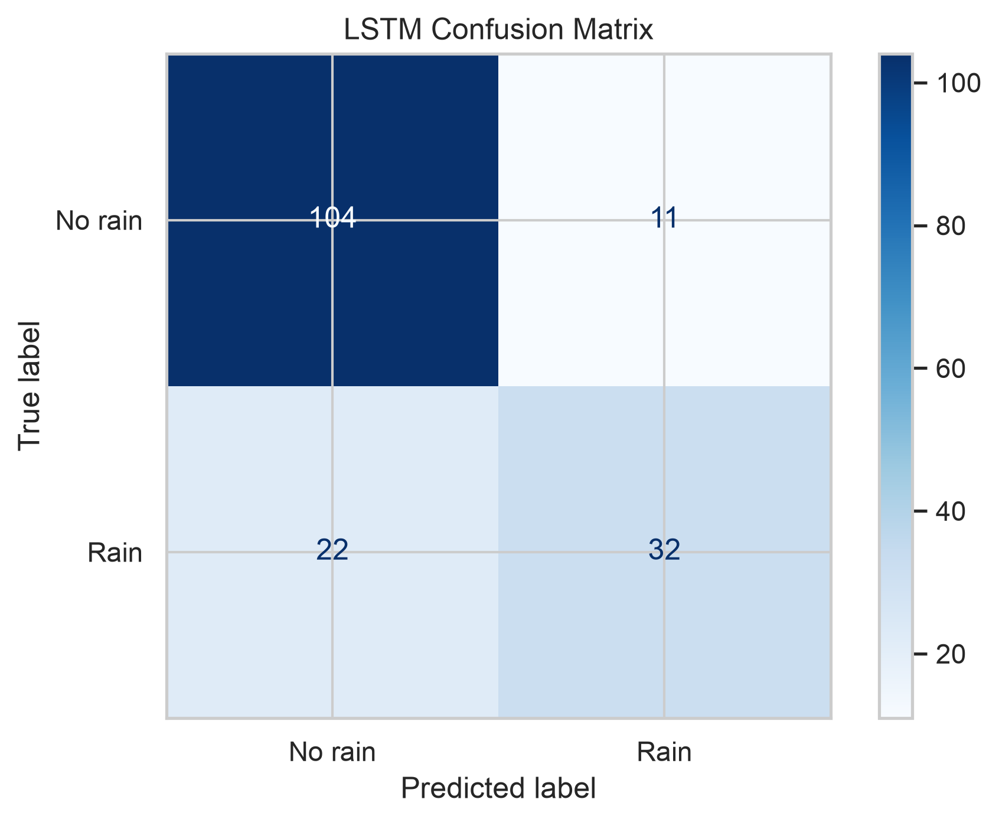

#Project Workflow

```text
Historical Weather Data
           │
           ▼
   Data Preprocessing
           │
           ▼
 Exploratory Data Analysis
           │
           ▼
 Feature Engineering
           │
           ▼
 ┌─────────────────────┐
 │ Dense Neural Network│
 └─────────────────────┘
           │
           ▼
 ┌─────────────────────┐
 │        LSTM         │
 └─────────────────────┘
           │
           ▼
 Model Evaluation
           │
           ▼
 Performance Comparison
```
# Deep Learning Models

## Dense Neural Network (DNN)

The Dense Neural Network (DNN) is a feed-forward neural network designed to classify whether a day is rainy based on meteorological variables. The model consists of fully connected layers with dropout regularization to reduce overfitting.

### Model Architecture


### Training Performance

Training Accuracy


Training Loss


### Model Evaluation

Confusion Matrix



---

## Long Short-Term Memory (LSTM)

The Long Short-Term Memory (LSTM) network captures temporal dependencies within weather observations by learning from sequences of previous days. This architecture is particularly suitable for rainfall forecasting because weather patterns evolve over time.

### Model Architecture


### Training Performance

Training Accuracy


Training Loss


### Model Evaluation

Confusion Matrix



---

# Model Comparison

The overall performance of both deep learning models is summarized below.


Both models were evaluated using:

- Accuracy
- Precision
- Recall
- F1-score
- Confusion Matrix

The Dense Neural Network provides a strong baseline classifier, while the LSTM leverages temporal relationships between consecutive weather observations, making it more suitable for sequential rainfall prediction tasks.
